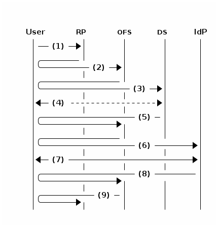

# OpenID Connect Provider implementation details

## Choice of SP

The choice of which SP should handle communication with the IdP is based on the requested scope: if ``persistent`` is
included in the requested scope the SP with that attribute requirement is selected, otherwise the transient SP is
chosen. This is handled by the micro service [`ScopeBasedRouting`](../../src/svs/scope_based_routing.py).


## User consent

Before releasing any information to the requesting RP, a consent page is displayed to the user when the SAML
authentication response is received. Only if the user consents to releasing all of the necessary information will the
id token be created and sent to the RP via the redirect URI. This is handled by the micro service
[`UserConsent`](../../src/svs/user_consent.py).


## Error codes



OpenID Connect errors:

| Case | Error | Response |
| ---- | ----- | -------- |
| (1) Users starts validation at RP | *out of scope* | - |
| (2) RP makes authentication request | RP is not registered at InAcademia | *RP is unknown, notify end-user and log it (we can't trust the redirect URI)* |
| | RP registered, but invalid client credentials (HTTP Basic auth) | `unauthorized_client` |
| | RP registered, but redirect URI not valid | `invalid_request`
| | Invalid scope requested | `invalid_scope` |
| | Response type not `id_token` | `unsupported_response_type` | 
| (3) InAcademia redirects user to discovery service | *out of scope* | - |
| (4) End-user selects and IdP | *out of scope* | - |
| (5) Response from discovery service | Invalid session state | *RP is unknown, notify end-user and log it* |
| | Selected IdP is not a member of eduGAIN | `access_denied` |
| (6) InAcademia creates SAML authentication request | Software and/or config error | HTTP 400 |
| (7) User authenticates at IdP | *out of scope* | - |
| (8) IdP replies to InAcademia | User not authenticated | `access_denied` |
| | Incorrect SAML response | `access_denied` |
| | Missing attributes in reply | `access_denied` |
| | Incorrect values of attribute (only affiliation) | `access_denied` |
| (9) InAcademia asks user for consent | User does not give consent | `access_denied` |
| General errors | Unsolicited response at any endpoint | HTTP 404 |


# SAML Service Provider implementation details

## Persistent vs transient name id

Currently two different SP's are used in the InAcademia service to provide different attribute requirements.

### Transient SP attribute requirements

* Transient SAML nameID
* *required:* eduPersonAffiliation (urn:oid:1.3.6.1.4.1.5923.1.1.1.1)
* *optional:* schacHomeOrganization (urn:oid:1.3.6.1.4.1.25178.1.2.9)


### Persistent SP attribute requirements

To accommodate as many IdP's as possible the InAcademia service requests multiple attributes (persistent nameID,
eduPersonTargetedId, eduPersonPrincipalName) related to user id. See "Choose name id" below, as to how the final user
id is chosen.

* Persistent SAML nameID
* *required:* eduPersonAffiliation (urn:oid:1.3.6.1.4.1.5923.1.1.1.1)
* *optional:* schacHomeOrganization (urn:oid:1.3.6.1.4.1.25178.1.2.9)
* *optional:* eduPersonTargetedID (urn:oid:1.3.6.1.4.1.5923.1.1.1.10)
* *optional:* eduPersonPrincipleName (urn:oid:1.3.6.1.4.1.5923.1.1.1.6)


# Filter implementation details

## Affiliation validation

The affiliation is validated using the SAML attribute ``eduPersonAffiliation``. The following table shows the mapping
between scopes requested by RP's in the authentication request and the values of ``eduPersonAffiliation``

| Requested scope | Accepted values in `eduPersonAffiliation` |
| --------------- | ----------------------------------------- |
| `affiliated` | `student`, `emplyee`, `member` |
| `alum` | `alum` |
| `employee` | `employee` |
| `faculty+staff` | `faculty`, `staff` |
| `student` | `student` |

## Choose name id

To compute the user id on which to base the OpenID Connect `sub` claim, the following algorithm is used:

```
    If a transient user id is requested by the RP:
        Use the SAML nameID if it is transient.

    If a persistent user id is requested by the RP:
        Choose (in order) from the following list:

        1. Persistent SAML nameID
        2. eduPersonTargetedId
        3. eduPersonPrincipalName

    If none of the above attributes can be used, the transaction will fail.
```

## Additional claims

If the RP requests additional claims (`domain`) they will be returned if they are delivered by the users provider
and the RP is allowed to fetch them.

The `domain` is read from the `schacHomeOrganization` attribute in the authentication response from the IdP.
